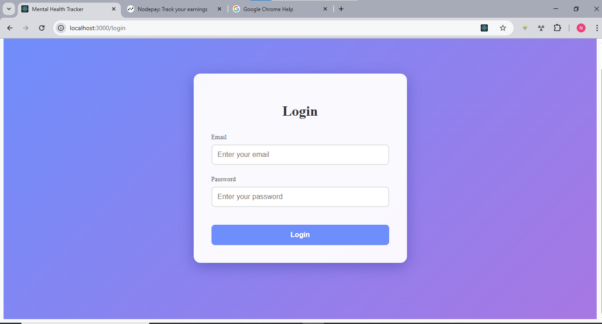
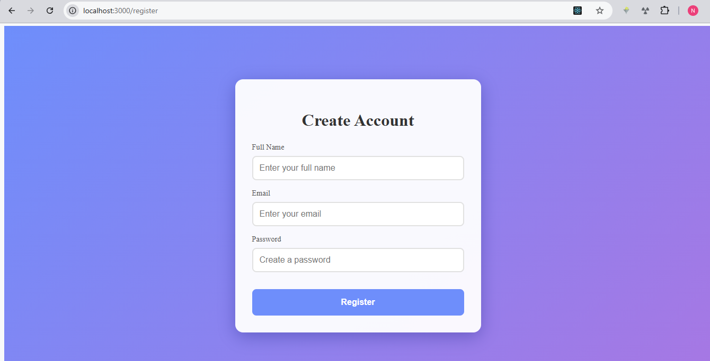
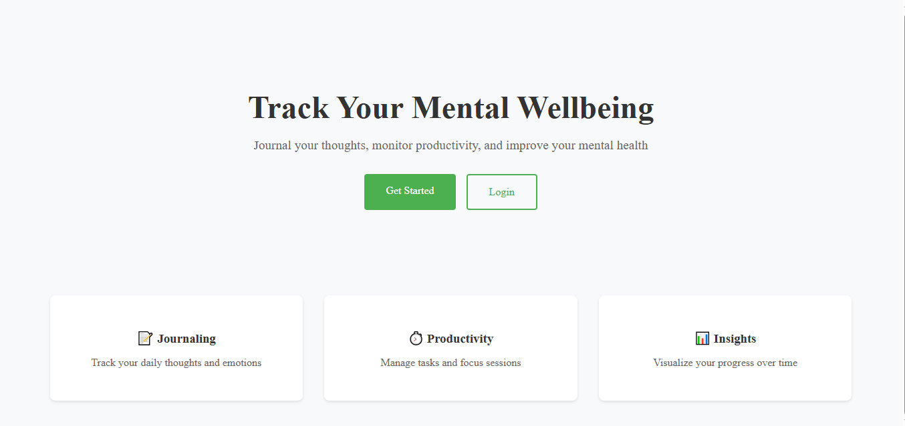
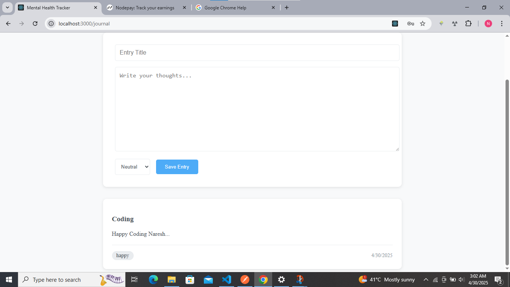
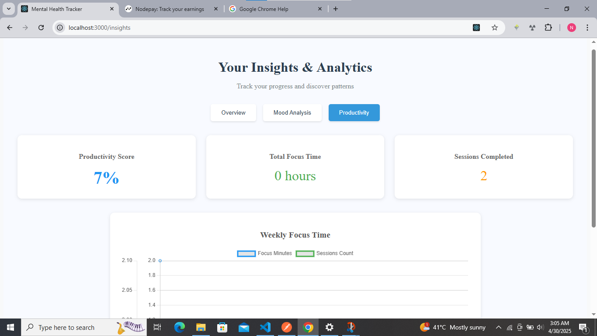
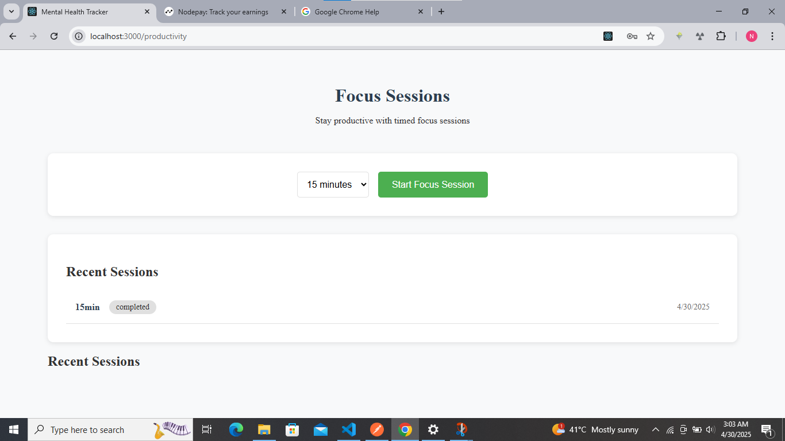
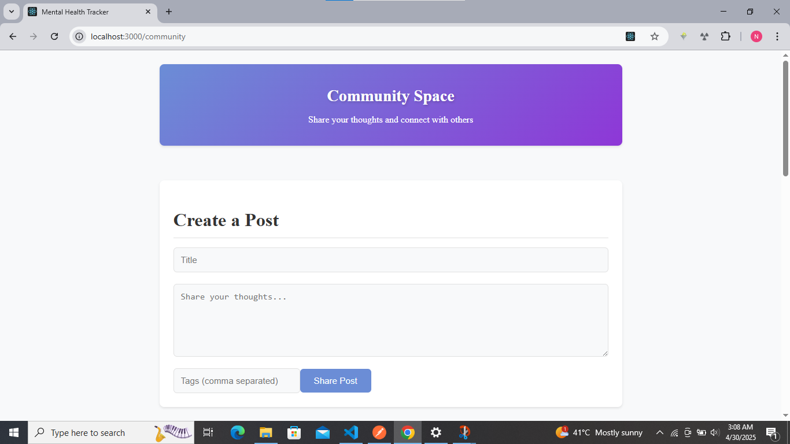
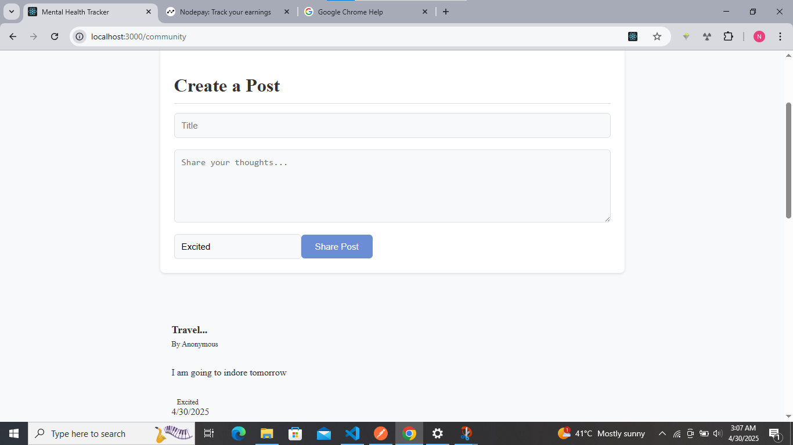
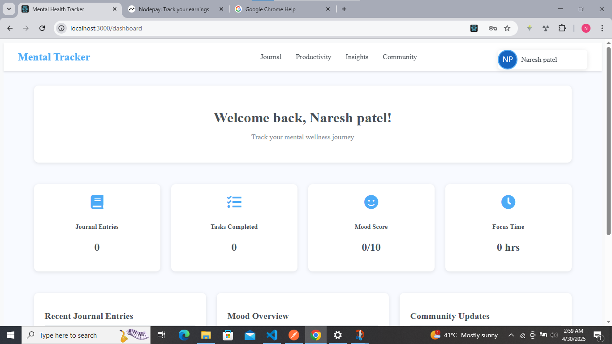

# 🧠 Mental Health  Tracker

A full-stack MERN application designed to help users track their emotions, plan their productivity, gain mental health insights, and engage in a supportive community. Includes AI-based sentiment analysis and journaling features to enhance self-awareness and wellbeing.

---

## 🌟 Key Features

- 📅 **Productivity Planner** – Plan your daily, weekly tasks and track progress.
- 📓 **Mood & Journal Tracker** – Record your emotions and thoughts daily.
- 📊 **Insights Dashboard** – Get visualized insights of your mental state and productivity trends.
- 👥 **Community Space** – Share and interact with others anonymously.
- 🧠 **AI Therapist & Sentiment Analysis** – AI-generated feedback, tips, and emotional assessment.
- 🛠️ **Admin Panel** – Manage user data, posts, and system logs securely.

---

## 🖼️ Screenshots
### Login Page


### Register Page


### Home Page


### Journal Page


### Insights Page


### Productivity Page


### Community Page


### Post Page


### Admin Page



---

## 🧰 Tech Stack

### Frontend
- React.js
- Redux Toolkit
- Tailwind CSS / SCSS
- Axios for API calls
- Chart.js or Recharts (for data visualization)

### Backend
- Node.js
- Express.js
- MongoDB (Mongoose)
- JWT for Authentication
- OpenAI / Sentiment Analysis APIs (optional)

---

## 🛠️ Installation & Setup

```bash
# Clone the repository
git clone https://github.com/yourusername/Mental-Health-Tracker.git

# Navigate into the client (frontend)
cd client
npm install
npm start

# Navigate into the server (backend)
cd server
npm install
npm run dev
```

> Ensure `.env` files are created in both `/client` and `/server` with appropriate API keys and database URIs.

---

## 📁 Folder Structure

```
Mental-Health-Tracker/
├── client/             # React Frontend
│   ├── public/
│   ├── src/
│   │   ├── pages/
│   │   ├── components/
│   │   └── redux/
│   └── .env
├── server/             # Express Backend
│   ├── controllers/
│   ├── models/
│   ├── routes/
│   ├── middleware/
│   └── .env
└── screenshots/            # Screenshots used in README
```

---

## 🔐 Authentication

- Secure JWT-based login and signup system.
- Protected routes for journaling, productivity, and admin panels.

---

## 🧠 AI & Sentiment Analysis

- Sentiment is analyzed from journal entries to track emotional health over time.
- Optional integration with OpenAI API for AI therapist and feedback suggestions.

---

## 🙌 Contributing

Pull requests are welcome. For major changes, please open an issue first to discuss what you'd like to change.

---

## 📜 License

This project is licensed under the MIT License.

---

## ✨ Credits

Developed by [Naresh Patel](https://github.com/nareshP-atel/Final-Project).
